# Home Credit Default Risk
Can you predict how capable each applicant is of repaying a loan? Script based on book "Applied Predictive Modeling" and [Bruce's Work](https://inclass.kaggle.com/moizzz/applied-predictive-modelling-brief-overview)

## Data
1. [Download Data](https://www.kaggle.com/c/home-credit-default-risk/data)
2. Place extracted data files into a folder called *input*, which should be on the same directory as the R script.

## Examples 
### Box Cox Data Transformation 
  before
  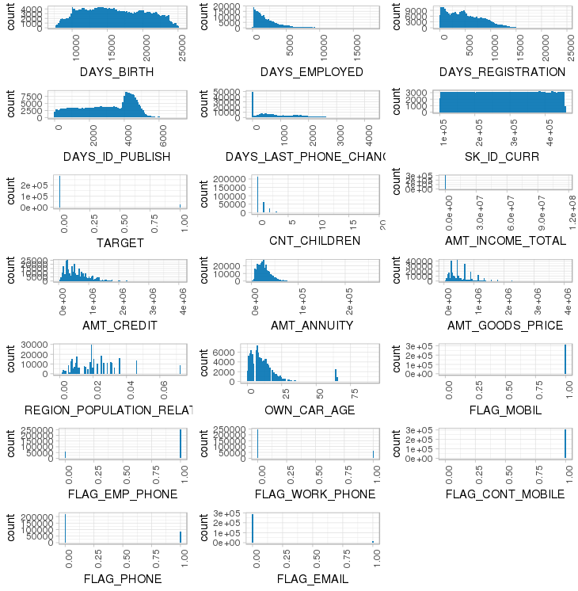
  after 
  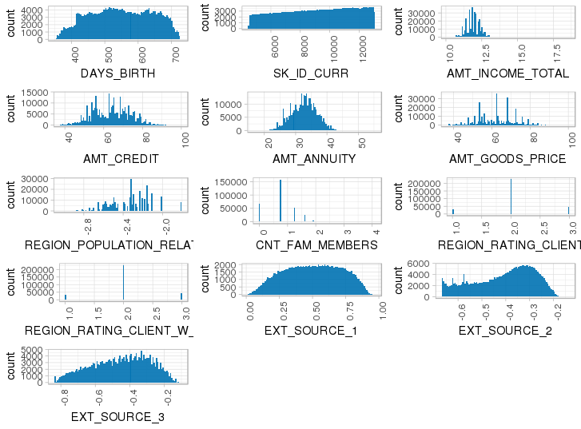
  one transformation example 
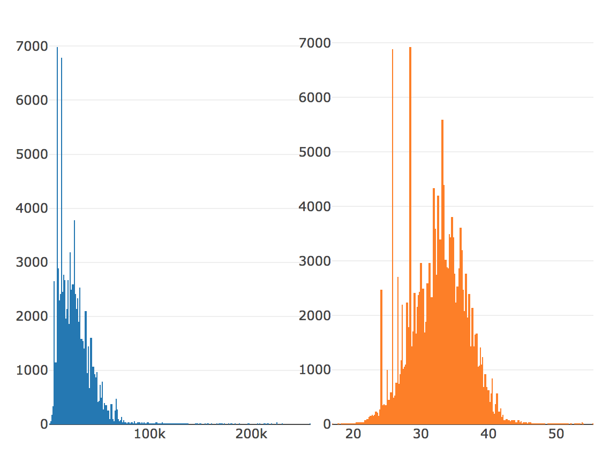
transformation decision metric 
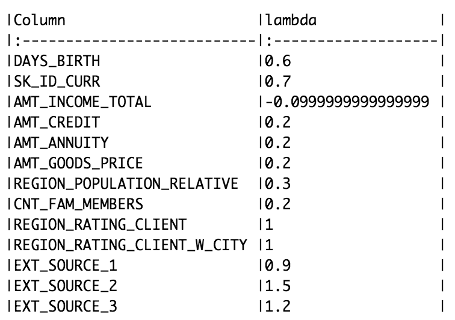
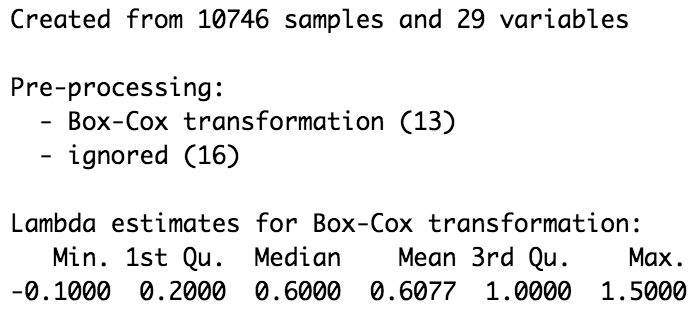

categorical variable profiling 
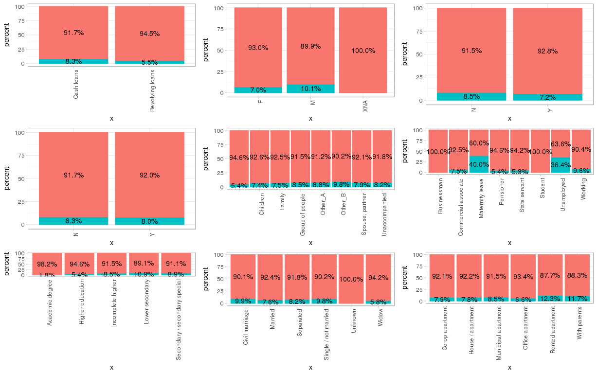
correlation between high dimensional data 
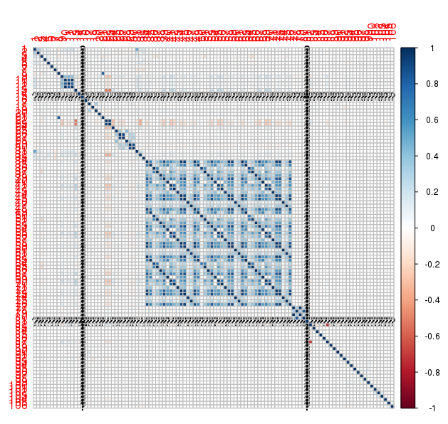

compare class probability of different models using calibration plot 

missing value handling 
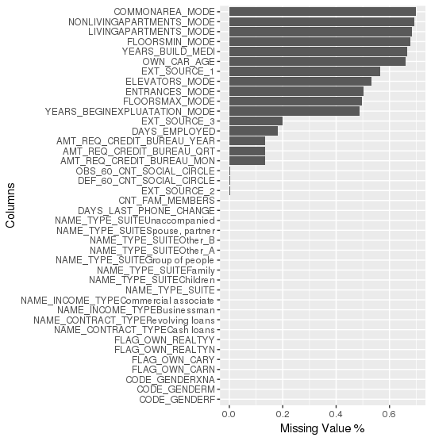
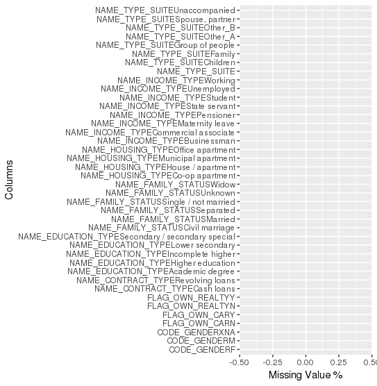

principle component 
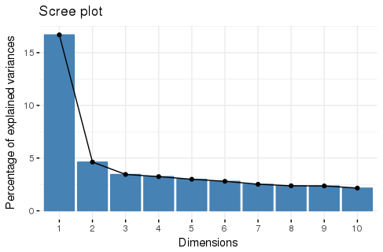

roc curve 
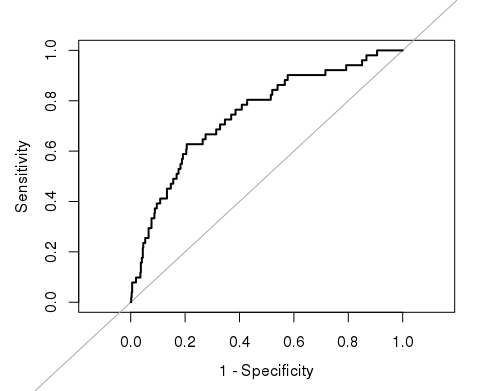

## Financial Data 
### ER diagram

### File size
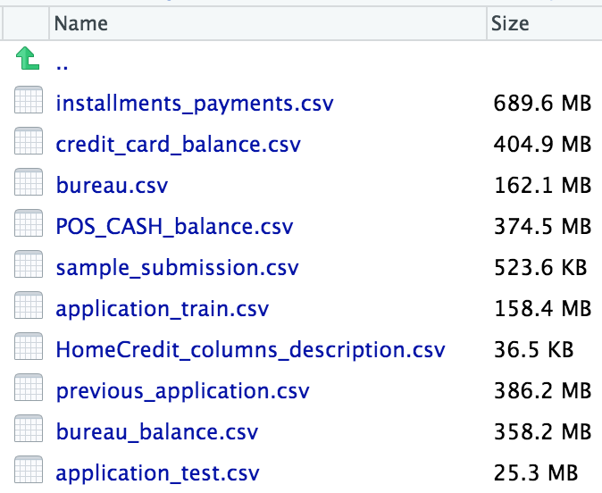

### Variable name
  [1] "DAYS_BIRTH"                   "DAYS_EMPLOYED"                "DAYS_REGISTRATION"           
  [4] "DAYS_ID_PUBLISH"              "DAYS_LAST_PHONE_CHANGE"       "SK_ID_CURR"                  
  [7] "**TARGET**"                       "NAME_CONTRACT_TYPE"           "CODE_GENDER"                 
  [10] "FLAG_OWN_CAR"                 "FLAG_OWN_REALTY"              "CNT_CHILDREN"                
  [13] "AMT_INCOME_TOTAL"             "AMT_CREDIT"                   "AMT_ANNUITY"                 
  [16] "AMT_GOODS_PRICE"              "NAME_TYPE_SUITE"              "NAME_INCOME_TYPE"            
  [19] "NAME_EDUCATION_TYPE"          "NAME_FAMILY_STATUS"           "NAME_HOUSING_TYPE"           
  [22] "REGION_POPULATION_RELATIVE"   "OWN_CAR_AGE"                  "FLAG_MOBIL"                  
  [25] "FLAG_EMP_PHONE"               "FLAG_WORK_PHONE"              "FLAG_CONT_MOBILE"            
 [28] "FLAG_PHONE"                   "FLAG_EMAIL"                   "OCCUPATION_TYPE"             
 [31] "CNT_FAM_MEMBERS"              "REGION_RATING_CLIENT"         "REGION_RATING_CLIENT_W_CITY" 
 [34] "WEEKDAY_APPR_PROCESS_START"   "HOUR_APPR_PROCESS_START"      "REG_REGION_NOT_LIVE_REGION"  
 [37] "REG_REGION_NOT_WORK_REGION"   "LIVE_REGION_NOT_WORK_REGION"  "REG_CITY_NOT_LIVE_CITY"      
 [40] "REG_CITY_NOT_WORK_CITY"       "LIVE_CITY_NOT_WORK_CITY"      "ORGANIZATION_TYPE"           
 [43] "EXT_SOURCE_1"                 "EXT_SOURCE_2"                 "EXT_SOURCE_3"                
 [46] "APARTMENTS_AVG"               "BASEMENTAREA_AVG"             "YEARS_BEGINEXPLUATATION_AVG" 
 [49] "YEARS_BUILD_AVG"              "COMMONAREA_AVG"               "ELEVATORS_AVG"               
 [52] "ENTRANCES_AVG"                "FLOORSMAX_AVG"                "FLOORSMIN_AVG"               
 [55] "LANDAREA_AVG"                 "LIVINGAPARTMENTS_AVG"         "LIVINGAREA_AVG"              
 [58] "NONLIVINGAPARTMENTS_AVG"      "NONLIVINGAREA_AVG"            "APARTMENTS_MODE"             
 [61] "BASEMENTAREA_MODE"            "YEARS_BEGINEXPLUATATION_MODE" "YEARS_BUILD_MODE"            
 [64] "COMMONAREA_MODE"              "ELEVATORS_MODE"               "ENTRANCES_MODE"              
 [67] "FLOORSMAX_MODE"               "FLOORSMIN_MODE"               "LANDAREA_MODE"               
 [70] "LIVINGAPARTMENTS_MODE"        "LIVINGAREA_MODE"              "NONLIVINGAPARTMENTS_MODE"    
 [73] "NONLIVINGAREA_MODE"           "APARTMENTS_MEDI"              "BASEMENTAREA_MEDI"           
 [76] "YEARS_BEGINEXPLUATATION_MEDI" "YEARS_BUILD_MEDI"             "COMMONAREA_MEDI"             
 [79] "ELEVATORS_MEDI"               "ENTRANCES_MEDI"               "FLOORSMAX_MEDI"              
 [82] "FLOORSMIN_MEDI"               "LANDAREA_MEDI"                "LIVINGAPARTMENTS_MEDI"       
 [85] "LIVINGAREA_MEDI"              "NONLIVINGAPARTMENTS_MEDI"     "NONLIVINGAREA_MEDI"          
 [88] "FONDKAPREMONT_MODE"           "HOUSETYPE_MODE"               "TOTALAREA_MODE"              
 [91] "WALLSMATERIAL_MODE"           "EMERGENCYSTATE_MODE"          "OBS_30_CNT_SOCIAL_CIRCLE"    
 [94] "DEF_30_CNT_SOCIAL_CIRCLE"     "OBS_60_CNT_SOCIAL_CIRCLE"     "DEF_60_CNT_SOCIAL_CIRCLE"    
 [97] "FLAG_DOCUMENT_2"              "FLAG_DOCUMENT_3"              "FLAG_DOCUMENT_4"             
[100] "FLAG_DOCUMENT_5"              "FLAG_DOCUMENT_6"              "FLAG_DOCUMENT_7"             
[103] "FLAG_DOCUMENT_8"              "FLAG_DOCUMENT_9"              "FLAG_DOCUMENT_10"            
[106] "FLAG_DOCUMENT_11"             "FLAG_DOCUMENT_12"             "FLAG_DOCUMENT_13"            
[109] "FLAG_DOCUMENT_14"             "FLAG_DOCUMENT_15"             "FLAG_DOCUMENT_16"            
[112] "FLAG_DOCUMENT_17"             "FLAG_DOCUMENT_18"             "FLAG_DOCUMENT_19"            
[115] "FLAG_DOCUMENT_20"             "FLAG_DOCUMENT_21"             "AMT_REQ_CREDIT_BUREAU_HOUR"  
[118] "AMT_REQ_CREDIT_BUREAU_DAY"    "AMT_REQ_CREDIT_BUREAU_WEEK"   "AMT_REQ_CREDIT_BUREAU_MON"   
[121] "AMT_REQ_CREDIT_BUREAU_QRT"    "AMT_REQ_CREDIT_BUREAU_YEAR"  

## Business Case 
  Many people struggle to get loans due to insufficient or non-existent credit histories. And, unfortunately, this population is often taken advantage of by untrustworthy lenders.
  [Home Credit](http://www.homecredit.net/) strives to broaden financial inclusion for the unbanked population by providing a positive and safe borrowing experience. In order to make sure this underserved population has a positive loan experience, Home Credit makes use of a variety of alternative data--including telco and transactional information--to predict their clients' repayment abilities.
  
